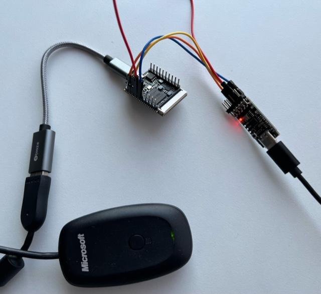

# Lichee Pi Nano buildroot with USB-OTG

## Overview
* Slighted modified version of [Lichee Pi Nano buildroot](https://github.com/unframework/licheepi-nano-buildroot) with USB-OTG and others.
* Added USB-OTG support through kernel patch from linux-sunxi.
* Enabled xpad (Xbox controller) driver.

nand2mario, 2022.11

## Hardware setup



PC -> USB-serial dongle -> Lichee Pi Nano -> USG-OTG dongle -> USB device (hub, Xbox controller connector ...)

* 4 wires from USB-serial dongle to Lichee Pi Nano: GND to GND, TX to U0RX, Rx to U0TX, 5V to 5V (Nano is powered by this). 

## Build process

This is for Ubuntu 20,
```
sudo apt install gcc-arm-linux-gnueabi

# download and extract buildroot 2020.2 from buildroot.org

cd buildroot-2020.02
BR2_EXTERNAL=../licheepi-nano-buildroot make
```

Wait 30 minutes and the sd card image will be at `output/images/sdcard.img`, use Baleno or similar tools to write it to tf card and then boot LicheePi Nano with it.

## Boot

UART at baud rate 115200 will show something like this,

```
U-Boot SPL 2021.01 (Nov 03 2022 - 02:03:44 +0800)
DRAM: 32 MiB
Trying to boot from MMC1


U-Boot 2021.01 (Nov 03 2022 - 02:03:44 +0800) Allwinner Technology

CPU:   Allwinner F Series (SUNIV)
Model: Lichee Pi Nano
DRAM:  32 MiB
MMC:   SUNXI SD/MMC: 0
Loading Environment from FAT... *** Warning - bad CRC, using default environment

In:    serial@1c25000
Out:   serial@1c25000
Err:   serial@1c25000
Net:   No ethernet found.
starting USB...
No working controllers found
Hit any key to stop autoboot:  0
switch to partitions #0, OK
mmc0 is current device
Scanning mmc 0:1...
Found U-Boot script /boot.scr
286 bytes read in 2 ms (139.6 KiB/s)
## Executing script at 80c50000
8983 bytes read in 3 ms (2.9 MiB/s)
4142496 bytes read in 198 ms (20 MiB/s)
## Flattened Device Tree blob at 80c00000
   Booting using the fdt blob at 0x80c00000
   Loading Device Tree to 816fa000, end 816ff316 ... OK

Starting kernel ...

[    0.000000] Booting Linux on physical CPU 0x0
[    0.000000] Linux version 5.11.0-licheepi-nano (zf@legion) (arm-buildroot-linux-gnueabi-gcc.br_real (Buildroot 2020.02) 8.3.0, GNU ld (GNU Binutils) 2.32) #1 Thu Nov 3 13:57:07 HKT 2022
[    0.000000] CPU: ARM926EJ-S [41069265] revision 5 (ARMv5TEJ), cr=0005317f
[    0.000000] CPU: VIVT data cache, VIVT instruction cache
[    0.000000] OF: fdt: Machine model: Lichee Pi Nano (Custom)
[    0.000000] Memory policy: Data cache writeback
[    0.000000] Zone ranges:
[    0.000000]   Normal   [mem 0x0000000080000000-0x0000000081ffffff]
[    0.000000]   HighMem  empty
[    0.000000] Movable zone start for each node
[    0.000000] Early memory node ranges
[    0.000000]   node   0: [mem 0x0000000080000000-0x0000000081ffffff]
[    0.000000] Initmem setup node 0 [mem 0x0000000080000000-0x0000000081ffffff]
[    0.000000] Built 1 zonelists, mobility grouping on.  Total pages: 8128
[    0.000000] Kernel command line: console=tty0 console=ttyS0,115200 panic=5 rootwait root=/dev/mmcblk0p2 rw
[    0.000000] Dentry cache hash table entries: 4096 (order: 2, 16384 bytes, linear)
[    0.000000] Inode-cache hash table entries: 2048 (order: 1, 8192 bytes, linear)
[    0.000000] mem auto-init: stack:off, heap alloc:off, heap free:off
[    0.000000] Memory: 22308K/32768K available (6144K kernel code, 623K rwdata, 1572K rodata, 1024K init, 227K bss, 10460K reserved, 0K cma-reserved, 0K highmem)
[    0.000000] SLUB: HWalign=32, Order=0-3, MinObjects=0, CPUs=1, Nodes=1
[    0.000000] NR_IRQS: 16, nr_irqs: 16, preallocated irqs: 16
[    0.000000] random: get_random_bytes called from start_kernel+0x2e4/0x4d8 with crng_init=0
[    0.000009] sched_clock: 32 bits at 24MHz, resolution 41ns, wraps every 89478484971ns
[    0.000155] clocksource: timer: mask: 0xffffffff max_cycles: 0xffffffff, max_idle_ns: 79635851949 ns
[    0.000796] Console: colour dummy device 80x30
[    0.001771] printk: console [tty0] enabled
[    0.001911] Calibrating delay loop... 203.16 BogoMIPS (lpj=1015808)
[    0.070369] pid_max: default: 32768 minimum: 301
[    0.070940] Mount-cache hash table entries: 1024 (order: 0, 4096 bytes, linear)
[    0.071099] Mountpoint-cache hash table entries: 1024 (order: 0, 4096 bytes, linear)
[    0.073064] CPU: Testing write buffer coherency: ok
[    0.074986] Setting up static identity map for 0x80100000 - 0x80100058
[    0.076477] devtmpfs: initialized
[    0.084216] clocksource: jiffies: mask: 0xffffffff max_cycles: 0xffffffff, max_idle_ns: 19112604462750000 ns
[    0.084434] futex hash table entries: 256 (order: -1, 3072 bytes, linear)
[    0.084817] pinctrl core: initialized pinctrl subsystem
[    0.087180] NET: Registered protocol family 16
[    0.088768] DMA: preallocated 256 KiB pool for atomic coherent allocations
[    0.091250] thermal_sys: Registered thermal governor 'step_wise'
[    0.091452] cpuidle: using governor menu
[    0.131531] SCSI subsystem initialized
[    0.132045] usbcore: registered new interface driver usbfs
[    0.132318] usbcore: registered new interface driver hub
[    0.132541] usbcore: registered new device driver usb
[    0.133066] pps_core: LinuxPPS API ver. 1 registered
[    0.133161] pps_core: Software ver. 5.3.6 - Copyright 2005-2007 Rodolfo Giometti <giometti@linux.it>
[    0.133868] Advanced Linux Sound Architecture Driver Initialized.
[    0.135747] clocksource: Switched to clocksource timer
[    0.165996] NET: Registered protocol family 2
[    0.167595] tcp_listen_portaddr_hash hash table entries: 512 (order: 0, 4096 bytes, linear)
[    0.167828] TCP established hash table entries: 1024 (order: 0, 4096 bytes, linear)
[    0.167968] TCP bind hash table entries: 1024 (order: 0, 4096 bytes, linear)
[    0.168076] TCP: Hash tables configured (established 1024 bind 1024)
[    0.168405] UDP hash table entries: 256 (order: 0, 4096 bytes, linear)
[    0.168563] UDP-Lite hash table entries: 256 (order: 0, 4096 bytes, linear)
[    0.169174] NET: Registered protocol family 1
[    0.170326] NetWinder Floating Point Emulator V0.97 (double precision)
[    0.172149] Initialise system trusted keyrings
[    0.172829] workingset: timestamp_bits=30 max_order=13 bucket_order=0
[    0.191686] jffs2: version 2.2. (NAND) © 2001-2006 Red Hat, Inc.
[    0.193474] Key type asymmetric registered
[    0.193619] Asymmetric key parser 'x509' registered
[    0.193817] Block layer SCSI generic (bsg) driver version 0.4 loaded (major 252)
[    0.193925] io scheduler mq-deadline registered
[    0.193989] io scheduler kyber registered
[    0.196625] sun4i-usb-phy 1c13400.phy: Couldn't request ID GPIO
[    0.207355] suniv-f1c100s-pinctrl 1c20800.pinctrl: initialized sunXi PIO driver
[    0.391275] Serial: 8250/16550 driver, 8 ports, IRQ sharing disabled
[    0.397618] suniv-f1c100s-pinctrl 1c20800.pinctrl: supply vcc-pe not found, using dummy regulator
[    0.399858] printk: console [ttyS0] disabled
[    0.420313] 1c25000.serial: ttyS0 at MMIO 0x1c25000 (irq = 25, base_baud = 6250000) is a 16550A
[    0.863113] printk: console [ttyS0] enabled
[    0.872062] suniv-f1c100s-pinctrl 1c20800.pinctrl: supply vcc-pd not found, using dummy regulator
[    0.893255] SCSI Media Changer driver v0.25
[    0.899115] suniv-f1c100s-pinctrl 1c20800.pinctrl: supply vcc-pc not found, using dummy regulator
[    0.908969] sun6i-spi 1c05000.spi: Failed to request TX DMA channel
[    0.915375] sun6i-spi 1c05000.spi: Failed to request RX DMA channel
[    0.923957] spi-nor spi0.0: unrecognized JEDEC id bytes: 0b 40 18 0b 40 18
[    0.931912] ehci_hcd: USB 2.0 'Enhanced' Host Controller (EHCI) Driver
[    0.938663] ehci-platform: EHCI generic platform driver
[    0.944310] ohci_hcd: USB 1.1 'Open' Host Controller (OHCI) Driver
[    0.950711] ohci-platform: OHCI generic platform driver
[    0.956568] usbcore: registered new interface driver usb-storage
[    0.963746] udc-core: couldn't find an available UDC - added [zero] to list of pending drivers
[    0.972938] sun4i-a10-lradc-keys 1c23400.lradc: keymap is missing in device tree
[    0.980585] sun4i-a10-lradc-keys: probe of 1c23400.lradc failed with error -22
[    0.988151] i2c /dev entries driver
[    0.993647] i2c i2c-0: Not using recovery: no recover_bus() found
[    1.004514] usbcore: registered new interface driver usbhid
[    1.010336] usbhid: USB HID core driver
[    1.015581] suniv-f1c100s-pinctrl 1c20800.pinctrl: supply vcc-pf not found, using dummy regulator
[    1.044094] NET: Registered protocol family 10
[    1.051449] Segment Routing with IPv6
[    1.055456] sit: IPv6, IPv4 and MPLS over IPv4 tunneling driver
[    1.064364] sunxi-mmc 1c0f000.mmc: initialized, max. request size: 16384 KB
[    1.072977] Loading compiled-in X.509 certificates
[    1.092856] suniv-f1c100s-pinctrl 1c20800.pinctrl: supply vcc-pd not found, using dummy regulator
[    1.103053] sun4i-backend 1e60000.display-backend: Couldn't find matching frontend, frontend features disabled
[    1.114101] sun4i-drm display-engine: bound 1e60000.display-backend (ops 0xc0738c28)
[    1.123430] sun4i-drm display-engine: bound 1c0c000.lcd-controller (ops 0xc07374ac)
[    1.133722] [drm] Initialized sun4i-drm 1.0.0 20150629 for display-engine on minor 0
[    1.363572] mmc0: host does not support reading read-only switch, assuming write-enable
[    1.365948] mmc0: new high speed SDXC card at address 59b4
[    1.388316] Console: switching to colour frame buffer device 100x30
[    1.390605] mmcblk0: mmc0:59b4 EC1S5 59.7 GiB
[    1.397126]  mmcblk0: p1 p2
[    1.521840] sun4i-drm display-engine: [drm] fb0: sun4i-drmdrmfb frame buffer device
[    1.546432] usb_phy_generic usb_phy_generic.0.auto: supply vcc not found, using dummy regulator
[    1.572592] musb-hdrc musb-hdrc.1.auto: MUSB HDRC host driver
[    1.593207] musb-hdrc musb-hdrc.1.auto: new USB bus registered, assigned bus number 1
[    1.618672] hub 1-0:1.0: USB hub found
[    1.637453] hub 1-0:1.0: 1 port detected
[    1.657987] zero gadget: Gadget Zero, version: Cinco de Mayo 2008
[    1.678891] zero gadget: zero ready
[    1.698169] ALSA device list:
[    1.715164]   #0: Loopback 1
[    1.748049] random: fast init done
[    1.767480] EXT4-fs (mmcblk0p2): mounted filesystem with ordered data mode. Opts: (null). Quota mode: disabled.
[    1.805937] VFS: Mounted root (ext4 filesystem) on device 179:2.
[    1.828688] devtmpfs: mounted
[    1.852226] Freeing unused kernel memory: 1024K
[    1.871168] Run /sbin/init as init process
[    2.055092] EXT4-fs (mmcblk0p2): re-mounted. Opts: (null). Quota mode: disabled.
Starting syslogd: OK
Starting klogd: OK
Running sysctl: OK
Saving random seed: [    2.648820] random: dd: uninitialized urandom read (512 bytes read)
OK
Starting network: OK

Welcome to LicheePi Nano
licheepi-nano login: root
Password: root
# lsusb
Bus 001 Device 001: ID 1d6b:0002

# [  975.878999] usb 1-1: USB disconnect, device number 2
[  983.015860] usb 1-1: new full-speed USB device number 3 using musb-hdrc
[  983.224121] input: Logitech USB Receiver as /devices/platform/soc/1c13000.usb/musb-hdrc.1.auto/usb1/1-1/1-1:1.0/0003:046D:C52B.0001/input/input0
[  983.328093] hid-generic 0003:046D:C52B.0001: input: USB HID v1.11 Keyboard [Logitech USB Receiver] on usb-musb-hdrc.1.auto-1/input0
[  983.393505] input: Logitech USB Receiver Mouse as /devices/platform/soc/1c13000.usb/musb-hdrc.1.auto/usb1/1-1/1-1:1.1/0003:046D:C52B.0002/input/input1
[  983.436019] input: Logitech USB Receiver Consumer Control as /devices/platform/soc/1c13000.usb/musb-hdrc.1.auto/usb1/1-1/1-1:1.1/0003:046D:C52B.0002/input/input2
[  983.547019] input: Logitech USB Receiver System Control as /devices/platform/soc/1c13000.usb/musb-hdrc.1.auto/usb1/1-1/1-1:1.1/0003:046D:C52B.0002/input/input3
[  983.592257] hid-generic 0003:046D:C52B.0002: input,hiddev0: USB HID v1.11 Mouse [Logitech USB Receiver] on usb-musb-hdrc.1.auto-1/input1
[  983.656325] hid-generic 0003:046D:C52B.0003: hiddev1: USB HID v1.11 Device [Logitech USB Receiver] on usb-musb-hdrc.1.auto-1/input2

```

The last part is after plugging a USB keyboard-mouse combo.